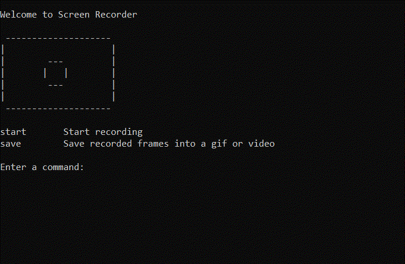

# Screen Recorder

A handy tool that allows you to record your screen from the command line.

Features:

- Record your screen with a few commands
- Capture the entire screen or a portion of the screen
- Preview the recording area in a popup window
- Choose the frames to include in the recording
- Export the recording to different formats (gif, avi)

&nbsp;



_Demo of tool, recorded with Screen Recorder._

## Installation

Make sure you have Python installed.

1. Clone this Github repository
2. Install dependencies: `pip install -r requirements.txt`

Run `main.py` to launch the tool:

```
python main.py
```

The tool will save the recording file to the same directory that main.py is located in.

## Technical Info

The project uses the PIL library to take screenshots and saves them to a folder, which will be used to generate the recording. The average time between each screenshot is written in `info.txt`.

For saving the recording into a gif or video, the project takes all the saved images and converts them into a gif with the PIL library or a video with the Python OpenCV library.

The projects uses the Tkinter library to show a preview window of the recording area.
